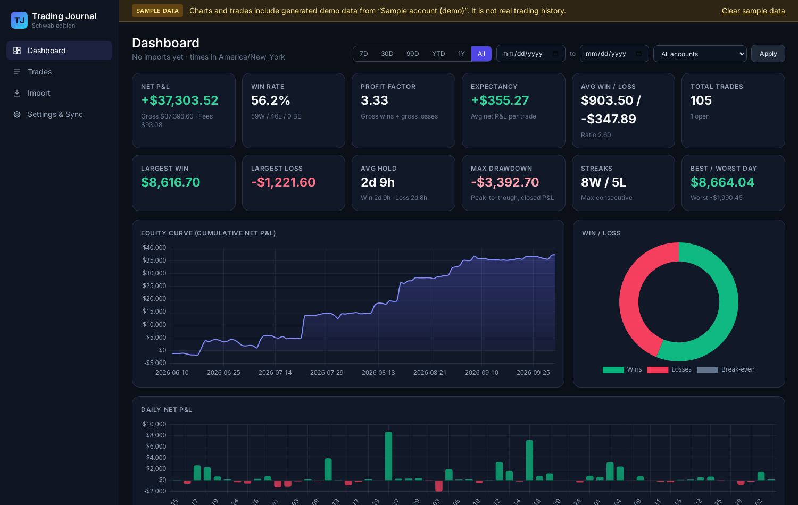

# Trading Journal (Schwab edition)

A private, single-user trading journal in the spirit of TraderSync, built for a Charles Schwab account.
You import your Schwab history, it groups fills into round-trip trades, and you get performance stats,
per-trade pages with a price chart, and journal notes, tags, setups and ratings.



## Features
- **CSV import (the main way to get data in)**: drag and drop, preview (new / merge / duplicate), then
  commit, with an import history and undo. The file format is detected automatically:
  - **Schwab.com Transactions export** (Accounts → History → Transactions → Export → CSV). Includes fees,
    expirations and assignments, but no execution times.
  - **thinkorswim Account Statement** (Monitor → Account Statement → Export to file). Has exact fill
    times but no fees.
  - Importing both is safe. A fill that appears in both files is merged into one: thinkorswim adds the
    time and Schwab.com adds the fees. Re-importing overlapping date ranges creates no duplicates.
  - Fills are matched across sources (files, SnapTrade, Schwab API) on the ET trade date, symbol, side,
    quantity and price (small tolerance); thinkorswim partial fills are summed and matched to the single
    Schwab/SnapTrade row by quantity and VWAP. thinkorswim's Exec Time zone is detected from US market
    hours (it uses your computer's zone, e.g. Dublin), `TOS_TIMEZONE` is only the fallback.
  - Imports default to your existing account (matched by account number when the file has one). An
    import that landed in the wrong account can be moved from Import history ("Move"), which re-matches
    its fills there and carries journal notes over. Settings → backup.json downloads a full JSON backup.
- **Trade builder**: FIFO matching per account and symbol, scaling in and out, partial closes, long and
  short, flips (one fill that closes a position and opens the opposite one is split, with fees split
  pro rata), options at a 100× multiplier. Expirations, assignments and exercises close positions. An
  option still open after its expiry is closed at $0 automatically. A closing fill with no matching
  open position (because it opened before your imported history) is reported in Settings instead of
  being turned into a fake short.
- **Dashboard**:
  - Net and gross P&L, fees, win rate, profit factor, expectancy, average win and loss, largest win and
    loss, average hold time, max drawdown, streaks, best and worst day.
  - Equity curve, daily P&L, and a P&L calendar heatmap.
  - P&L by symbol, by weekday, by hour of entry and by holding time.
  - Long vs short, stocks vs options, by setup and by tag.
  - Date-range and account filters.
- **Trades list**: sortable and filterable by symbol, side, status, outcome, asset type, setup and tag.
  Paginated.
- **Trade detail page**:
  - Executions table, P&L, fees, return %, hold time.
  - MFE/MAE (max favourable / adverse excursion) from price bars.
  - Full-screen candlestick chart (TradingView lightweight-charts) with entry/exit markers, timeframe
    picker (1m-1W), volume + MA(20) and indicators (SMA, EMA, VWAP, Bollinger, RSI, MACD, ATR).
  - Journal: notes, tags, setup, 1–5 star rating. These are kept when trades are rebuilt.
- **Sync engine with pluggable data sources** (`app/sources/`). Syncing is manual: the "Sync now"
  button (or `python -m app.sync` from a shell) runs every enabled source and then rebuilds trades.
  There is no scheduled sync. Sources: **Schwab via SnapTrade** (works with Schwab International
  accounts) and an optional **Schwab Trader API** source (US accounts). Both are off unless their env
  vars are set.
- **Sample-data mode**: always labelled "Sample data", kept in its own account, and removable with one
  click in Settings.
- **Single-user login**: password from `APP_PASSWORD`, signed session cookie, simple brute-force
  throttle.

## Run locally
```bash
python3.12 -m venv .venv && . .venv/bin/activate
pip install -r requirements-dev.txt
cp .env.example .env            # set APP_PASSWORD
python -m app.migrate           # create / upgrade the SQLite schema
python -m app.seed_demo         # optional sample data (remove with --clear or the Settings button)
uvicorn app.main:app --reload   # http://127.0.0.1:8000
pytest -q                       # tests
```

## Deploy on Render
`render.yaml` defines a free Python web service and a free Postgres database.
- Start command: `alembic upgrade head && uvicorn app.main:app --host 0.0.0.0 --port $PORT ...`
- Health check: `/healthz`
- Required env vars:
  - `APP_PASSWORD`: your login.
  - `SECRET_KEY`: random value.
  - `DATABASE_URL`: the Postgres internal URL. `postgres://` URLs are converted automatically.
  - `COOKIE_SECURE=true`.
- Optional env vars: `SNAPTRADE_CLIENT_ID`, `SNAPTRADE_CONSUMER_KEY`, `TOKEN_ENCRYPTION_KEY`,
  `DISPLAY_TZ`, `PRICE_PROVIDER`, `POLYGON_API_KEY`, `SCHWAB_*`, `SMTP_*`.
- **Render free Postgres expires 30 days after creation.** Upgrade the database (or export your data)
  before then.
- Free web instances sleep after about 15 minutes idle, so the first request after that is slow.
- There is intentionally no cron job: sync runs only when you click "Sync now".

## P&L figures and ticker renames

- **Realized P&L** (dashboard) = net P&L of closed trades **plus** partial exits of
  still-open positions, after fees. Plain FIFO, no wash-sale adjustment (Schwab adds
  disallowed losses to the new lot's basis, so its realized/unrealized split can
  differ while the total is the same).
- **Unrealized (open)** = remaining FIFO lots marked at the latest SnapTrade price.
- **Total P&L** = realized + unrealized, checked against the broker:
  account value − net deposits (cash transfers in/out recorded by SnapTrade sync).
  A ✓ means the journal agrees with the account to within $1. This is the number to
  compare with a thinkorswim Account Statement "P/L Diff" covering the whole history
  (P/L Diff = P/L YTD at end − P/L YTD at start, open + closed positions).
- **Ticker renames:** SnapTrade keeps the old ticker on past activities while
  thinkorswim rewrites history with the new one (e.g. EchoStar SATS → ECHO on
  2026-06-24). The journal maps old → new so fills from both sources merge and a
  position continues across the rename. Built-in renames are listed in
  Settings → Ticker renames; renames are also detected automatically when two
  sources report ≥ 2 identical fills under different tickers, and you can add or
  disable mappings there (`OLD=NEW`, or `OLD=` to disable). Saving re-matches all
  imports and rebuilds trades.

## Price charts
`PRICE_PROVIDER=auto` tries, in order:
1. Schwab market data (if the Schwab API source is connected).
2. Polygon.io (if `POLYGON_API_KEY` is set).
3. Yahoo Finance's public chart endpoint. This is unofficial, best effort and may break.

Set `PRICE_PROVIDER=none` to turn charts off. Option trades are charted on the underlying stock.

The trade page opens full screen (sidebar collapsed, toggle with the ☰ button; the journal is a
right-hand panel you can hide). Chart timeframes: 1m, 5m, 15m, 30m, 1h, 4h, 1D, 1W
(`/trades/{id}/chart.json?tf=5m`). Defaults: multi-day (swing) trades and trades whose fills have no
time of day open on 1D; intraday trades with real times open on 5m (or 1h once 5m history is gone).
The last timeframe you picked for a trade is remembered in the browser.
Intraday history limits follow Yahoo: 1m for ~30 days (7 days per chart), 5m/15m/30m for ~60 days,
1h/4h for ~2 years; unavailable timeframes are disabled with the reason. 4h bars are built from 1h
bars (09:30 and 13:30 ET). Date-only fills are drawn on the day's last intraday bar and labelled
"time n/a". A volume pane with a 20-period volume MA sits under price.

Indicators are computed in the browser (TradingView's own indicator library can't be embedded in
lightweight-charts): SMA/EMA with any period (presets 10/20/21/50/200), VWAP (intraday, resets each
session), Bollinger Bands, RSI, MACD and ATR in their own panes. The selection is saved in the
browser's localStorage. "Open in TradingView" opens the symbol on tradingview.com.
MFE/MAE is computed on the default timeframe; for multi-day trades it uses whole daily bars, so it is
approximate.

## Schwab via SnapTrade (recommended; works for Schwab International)
[SnapTrade Personal](https://snaptrade.com/personal) is free for your own accounts.
1. Create a SnapTrade Personal account, connect Schwab in its dashboard (read-only), and create a
   Personal API key.
2. Set `SNAPTRADE_CLIENT_ID` and `SNAPTRADE_CONSUMER_KEY` (Render: service → Environment).
3. Click **Sync now**. The first sync pulls the full history SnapTrade has; later syncs fetch from the
   last synced day minus `SYNC_OVERLAP_DAYS` (3).

What to expect:
- SnapTrade refreshes Schwab transactions **once a day, one day behind**, so today's trades appear
  tomorrow. Rows are date-only, so fills are stamped 16:00 New York time, like the Schwab CSV.
  Importing a thinkorswim Account Statement adds exact fill times to the same fills.
- Fills are deduplicated by Schwab's own transaction reference id (SnapTrade's id is kept in the raw
  record), and fills already imported from a CSV are matched instead of duplicated.
- Option buys/sells use SnapTrade's `BUY_TO_OPEN`/`SELL_TO_CLOSE` hints; expirations, assignments and
  exercises close positions. Transfers, dividends and cash movements are ignored for trades.
- **Schwab logins expire after 7 days.** SnapTrade then marks the connection as disabled; the app shows
  a banner and a **Reconnect Schwab** button, which re-logs in the existing connection through
  SnapTrade's portal (the portal link is valid for 5 minutes). Settings shows the estimated next
  re-login date.

## Optional: Schwab Trader API source (US retail accounts only)
Schwab One International accounts cannot get Trader API apps, so for those accounts CSV import is the
way in. If you have a US account:
1. Create an account at https://developer.schwab.com and create an app with the API product
   **Accounts and Trading Production**.
2. Add callback URLs separated by commas (they must be HTTPS):
   `https://127.0.0.1:8182,https://<your-service>.onrender.com/auth/schwab/callback`
3. Wait for the status to change from "Approved – Pending" to **"Ready For Use"** (can take a few days).
4. Set these env vars:
   - `SCHWAB_APP_KEY` and `SCHWAB_APP_SECRET`
   - `SCHWAB_CALLBACK_URL`, matching one registered URL exactly, trailing slash included
   - `TOKEN_ENCRYPTION_KEY`
5. Click Settings → **Connect Schwab**. If you use the `127.0.0.1` callback, paste the URL you were
   redirected to into the form on that page.
6. Access tokens refresh automatically every 30 minutes. **Refresh tokens expire 7 days after you log
   in, and Schwab offers no way to extend them**, so the app shows a banner when less than 24 hours are
   left and you need to reconnect weekly.

The first sync walks back in 90-day chunks until the API refuses a date range or
`SCHWAB_MAX_LOOKBACK_DAYS` is reached. Each later sync covers from the last successful sync (minus 3
days of overlap) to now. Fills are deduplicated by Schwab `activityId`.

## Adding another automated source
Subclass `app.sources.base.DataSource` (`is_configured`, `status`, `sync`), store fills with
`app.services.ingest_records(db, account_id, "<source>", records)`, and register the class in
`app.sources.all_sources()`. The "Sync now" button, the CLI, the status banners and the sync
history pick it up automatically.

## Layout
```
app/
  main.py            FastAPI app, auth middleware
  models.py          SQLAlchemy models (accounts, executions, trades, fills, tags, imports, sync runs, tokens)
  importers/         schwab_csv.py, tos_statement.py
  sources/           base.py (DataSource interface), schwab_api.py
  trade_builder.py   pure FIFO round-trip builder (heavily unit-tested)
  services.py        ingest with cross-source dedupe/merge, trade rebuild
  stats.py           dashboard metrics
  prices.py          chart data providers, MFE/MAE
  sync.py            sync engine + CLI (python -m app.sync)
  seed_demo.py       sample data
alembic/             migrations
tests/               pytest suite
```

## Known limitations
- Schwab.com CSV rows have only a date, no time. Hold time for trades imported only from that file is
  day-level, and they are left out of hour-of-day stats. Importing a thinkorswim statement adds the
  exact times.
- Two same-day round trips in one symbol, imported from the date-only CSV, are merged into a single
  trade. The total P&L is still correct.
- Multi-leg spreads are journaled one leg per trade; there is no grouping into one spread trade yet.
  Stock splits and symbol changes are not adjusted.
- Expirations inferred for thinkorswim-only data are booked at $0. If the option was actually assigned,
  importing the Schwab.com CSV books it correctly.
- The Schwab API parsing (sign conventions, `RECEIVE_AND_DELIVER` descriptions) follows the public docs
  but hasn't been checked against a live account.
